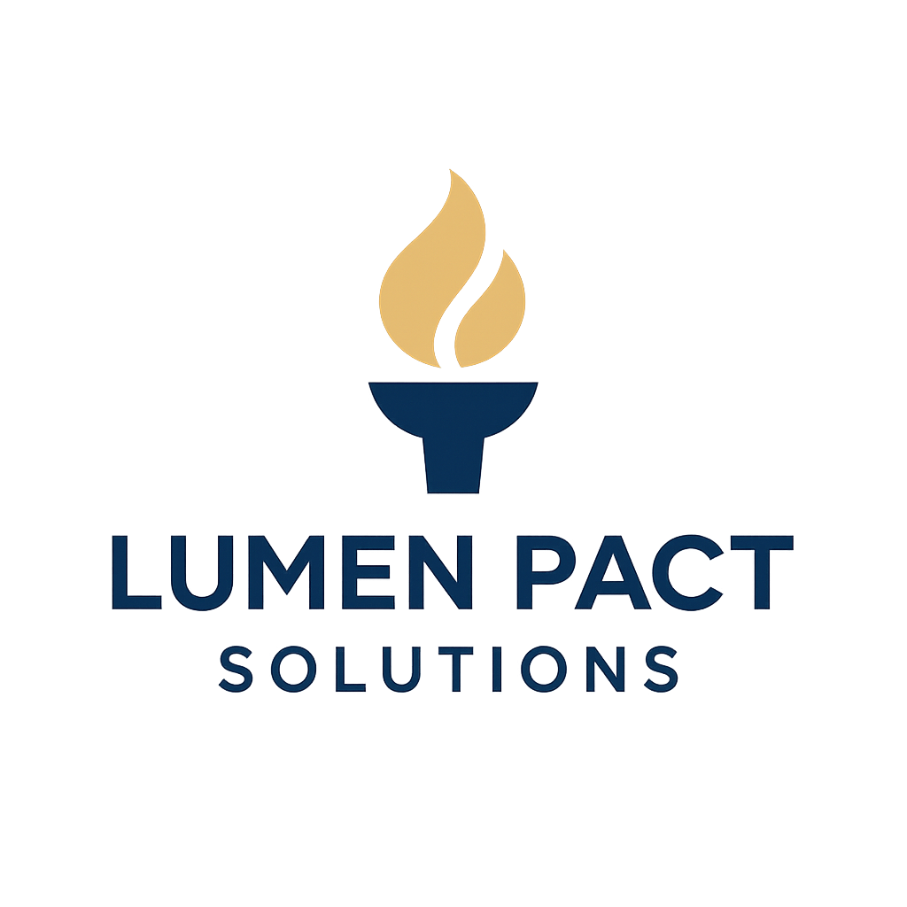

# Welcome to Lumen Pact Solutions
Providing insight into action.

This is the beginning of our website.  

<!-- Custom styles for background and text color -->

  
  <h1>Welcome to Lumen Pact Solutions</h1>
  
Transforming insight into action.

  
This is the beginning of your website. 
  You can add more pages, blog posts, or info as you grow!

